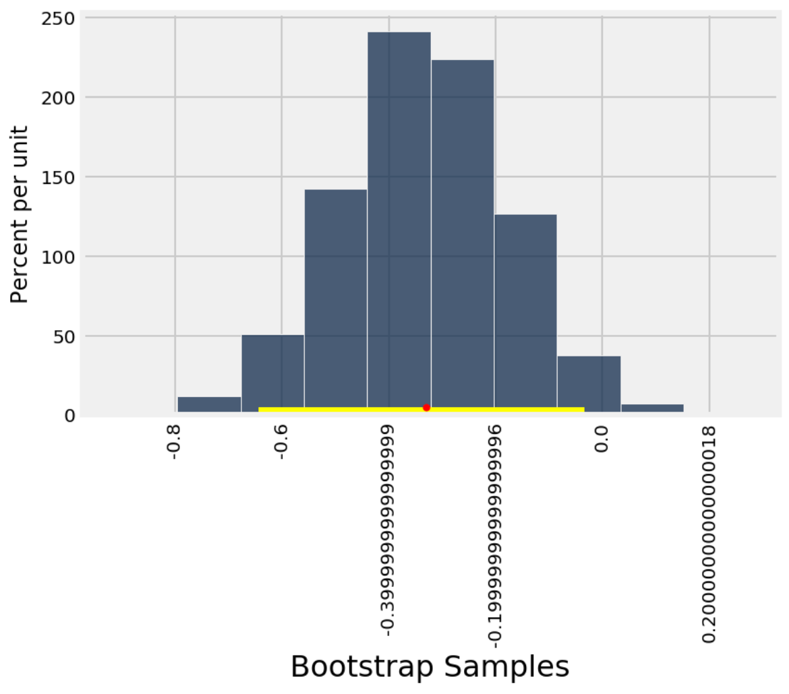

# t is for Table

t has the goal of building up on Pandas with the intent of making it more intuitive and extending it with further DataScience tools. 

For example it integrates Bootstrap ReSampling statistical methods (a.k.a [Hacker Statistics](https://speakerdeck.com/jakevdp/statistics-for-hackers))


## Basic Usage

```python
>>> df = pd.DataFrame( {
    'user':['k','j','k','t','k','j']
    ,'period':['pre', 'pre', 'pre', 'pre', 'post','post'] 
    , 'kpi':[13,12,2,12,43,34]
    })
```

**.** |**user**|**period**|**kpi**
:-----:|:-----:|:-----:|:-----:
0|k|pre|13
1|j|pre|12
2|k|pre|2
3|t|pre|12
4|k|post|43
5|j|post|34


```python
>>> t.select( t.where(df, "period", "post"), "user", "kpi")
```
**.** |**user**|**kpi**
:-----:|:-----:|:-----:
0|k|43
1|j|34


```python
>>> t.ci_mean(pd.DataFrame (np.random.normal(size=(37,2)), columns=['A', 'B']), 'A')
```
    {'mean': -0.33, '95% conf int of mean': array([-0.64, -0.03])}

including plotting it:




## Notebook of example usage

https://github.com/al3xandr3/Data-Science-ipynb/blob/master/t%20is%20for%20table%20version2.ipynb


## Run Tests

    > cd "C:\path\my\projects\t"
    > pytest